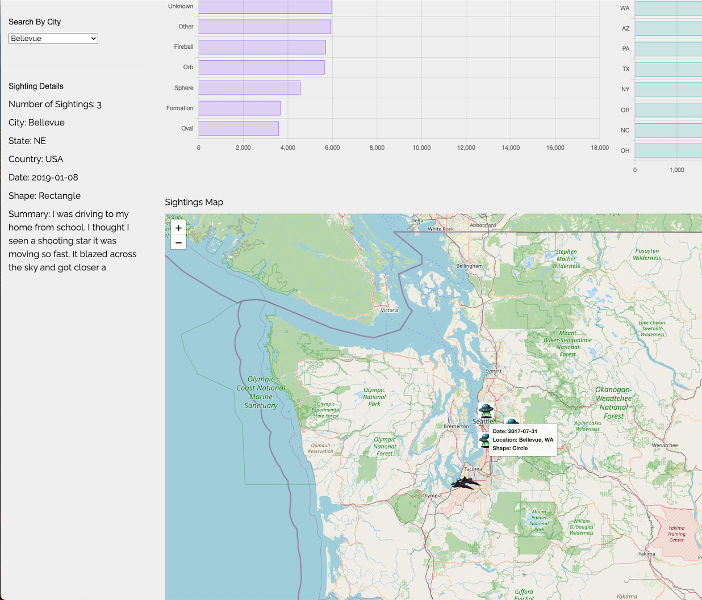

# You Only Know What UFO -Team 

** Project: Data Engineering and Visualization on UFO Sighting in USA and Relationship with Military Bases

## Table of Contents
- [Team Members](#team-members)
#- [UFO Reflection](#Ufo Relection)
- [Background](#background)
- [File Structure](#file-structure)
- [Research Questions](#research-questions)
- [Results](#results)
- [Discussion](#discussions)
- [Conclusions](#conclusions)
- [Acknowledgements](#acknowledgements)
- [References](#references)
- [Repository](repository)

## Team Members
- Albert Lee
- Courtney Cole
- Garrett Foley
- Matt Mcdowell
- Mohamed Ibrahim
  
## UFO Reflection
- History Channel: https://www.history.com/ufo-sightings-location-map 
- Medium: https://towardsdatascience.com/data-analysis-everything-youve-ever-wanted-to-know-about-ufo-sightings-e16f2ed34151 

## Data Sources
- UFO Sightings: https://nuforc.org/subndx/?id=all 
- Military Base Locations: https://en.wikipedia.org/wiki/List_of_United_States_Air_Force_installations
- Coordinates: https://openweathermap.org/api/geocoding-api#direct_name 

## Introduction 
This Project is part of in KU Bootcamp challenge for data sciences and analysis. The project takes indepth view of data engineering, exploration, and visualization to finally deduce the story found in UFO data sets in USA. Our team goal is to understand the the relationship between places of UFO sighting and locations of military bases. This is expected to answer some of the questions that have surround the mystery of UFOs. 

## File Structure
- Data sourcing using relevant APIs
- Flask APP and related htmls, CSS 
- Data deployment to MongoDD
- Interactivity and visualizations

## Libraries Used: 
## Python libraries: 
- matplotlib.pyplot, pandas numpy, requests, warnings, time, hvplot, MongoClient, bs4 import BeautifulSoup, from splinter import Browser, from selenium import webdriver

## Applications/technologies: 

Jupyter Notebook, Selenium ChromeDriver, OpenWeather API - GeoAPIfy, Flask, MongoDB (NoSQL), JavaScript ES6, HTML5

## JavaScript libraries:
- Leaflet.js, Plotly, D3.jsm, New! https://react.dev/learn , New! https://www.chartjs.org/docs/latest/getting-started/ 

## Visualizations: 
- UFO Sightings Across the U.S.A. - Whiteboard (canva.com)

## Research Questions:
### 1. Is there a correlation with military bases and UFO sightings?

**Summary:** 

### 2. Which coast has the most encounters?
 Insert Images
**Summary:** 

### 3. What type of UFO is the most common?
 
**Summary:** 

### 1. Has there been an increase in UFO sightings since 2010?
 Insert Images
**Summary:** 

## Results 
Our analyses have provided several key insights into UFO sightings as shows in the images above. Data available have shown the trend and at least answered each questions wholly or partially. There is some significant relationship between UFO sighting and military bases. 

## Discussion 
The findings from our research offer important implications for public understanding of UFO and try to answer age old questions related to mystery of UFOs and Military. There were some limitation to the data, including the disparity betweeen distances of place of sighting and military bases. Some of the sighter reported when they were airborne, pinning it to exact location and we had to make assuptions or entire discard some of the data. 

## Conclusions 
In conclusion, our research sheds light on the complexity and mysterious nature of studying UFO and military information. From the data source we can say that there is positive/negative relationship between UFOs sighting and where military bases are located in USA. 

## Acknowledgments 
A big shout out to our instructor, Benjamen Alford, at the KU Data Analytics Boot Camp for his support and guidance throughout this project.

## Repository 

All code and datasets are maintained in the [UFO Sighting team GitHub Repository](https://github.com/gfoley15/you_only_know_what_UFO/tree/main).

