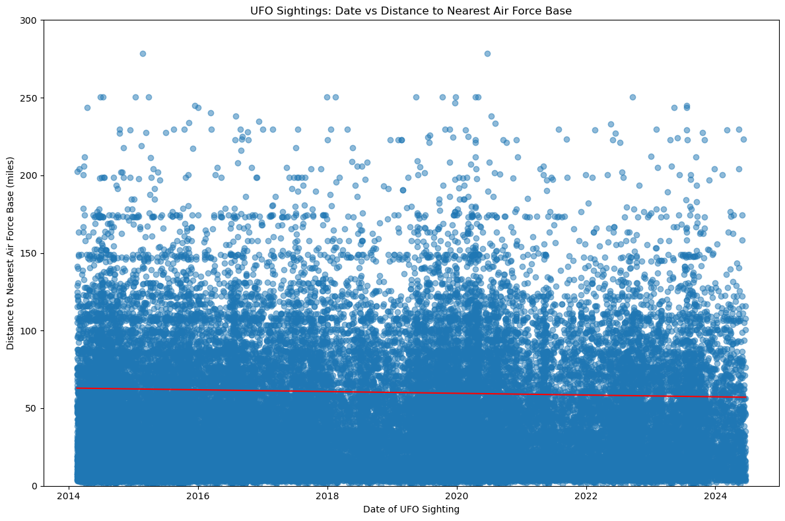

# You Only Know What UFO - Team Purple
** Project: Data Engineering and Visualization on UFO Sighting in USA and Relationship with Military Bases

## Introduction 
The project takes indepth view of data engineering, exploration, and visualization to finally deduce the story found in UFO data sets in USA. Our team goal is to understand the relationship between places of UFO sighting and locations of military bases. This is expected to answer some of the questions that have surround the mystery of UFOs.

## Table of Contents
- Team Members
- Project Inspiration
- Data Sources
- Data Flow
- Project Setup and Execution
- Technologies Used
- Research Questions
- Results
- Discussion
- Conclusions

## Team Members
- Albert Lee
- Courtney Cole
- Garrett Foley
- Matt McDowell
- Mohamed Ibrahim
  
## Project Inspiration
- History Channel: https://www.history.com/ufo-sightings-location-map 
- Medium: https://towardsdatascience.com/data-analysis-everything-youve-ever-wanted-to-know-about-ufo-sightings-e16f2ed34151 

## Data Sources
- UFO Sightings: https://nuforc.org/subndx/?id=all 
- Military Base Locations: https://en.wikipedia.org/wiki/List_of_United_States_Air_Force_installations
- OpenWeather API (for coordinates): https://openweathermap.org/api/geocoding-api#direct_name 

## Data Flow
Here is the project workflow from web scraping, flask app creation and javascript dashboard visualization.

## Project Setup and Execution
Ensure that you have access to the `Technologies Used` listed below in the next section.

### Installation
1. Clone the GitHub repository: `git clone https://github.com/gfoley15/you_only_know_what_UFO.git`
2. Navigate to the project directory on your local machine: `cd you_only_know_what_UFO`

### Database Setup
3. Run the Jupyter notebook to create the MongoDB database and collections: `03_Load_Sightings_AirForceBases.ipynb`
4. Execute all cells in the notebook to complete the database setup

### Running the Application
5. Navigate to the "flask_app & js" directory: `cd "flask_app & js"`
6. Start the Flask application: `python app.js`
7. Open your web browser and visit: `http://localhost:5000`

You should now see the application running in your browser.

## Technologies Used:
### Applications: 
- Jupyter Notebook, Selenium ChromeDriver, OpenWeather API - GeoAPIfy, Flask, MongoDB (NoSQL), JavaScript ES6, HTML5
### Python libraries: 
- matplotlib.pyplot, pandas numpy, requests, warnings, time, hvplot, MongoClient, BeautifulSoup, from splinter import Browser, from selenium import webdriver
### JavaScript libraries:
- D3.js, Chart.js, Plotly.js, Leaflet.js, Leaflet.MarkerCluster.js, App.js (Our JavaScript)
### Visualizations: 
- UFO Sightings Across the U.S.A. - Whiteboard (canva.com)

## Research Questions:
 - 1. Is there a correlation with military bases and UFO sightings?
 - 2. Which coast has the most encounters?
 - 3. What type of UFO is the most common?
 - 4. Has there been an increase in UFO sightings since 2010?

## Analysis 
The findings from our research offer important implications for public understanding of UFO and try to answer age old questions related to mystery of UFOs and Military. 
 - Light is the most common - are they airplanes or aliens? - followed by Circle and Triangle.
 - UFO sightings hav decrease since 2014. There was a slight increase in 2019 and 2020, but the general downtrend has remained consistent over the previous 10 year period.
 - According to the Top 10 States, California has the most recorded UFO sightings - 40% more than the next closest State, Florida. Due to California's significant amount of UFO sightings, plus 3 out of the Top 5 States in terms of sighting count (Arizona, Washington), the West Coast has more sightings.
 - There is a very weak correlation based on the Pearson correlation coefficient (r-value) of -0.01. This means that as dates increase (move forward in time), there's a very slight tendency for the distances to decrease, but the effect is negligible. With a correlation this close to zero, it's safe to say there's effectively no linear relationship between the date of UFO sightings and their distance to the nearest Air Force base.
     

## Conclusion
In conclusion, our research sheds light on the complexity and mysterious nature of studying UFO and military information. This result suggests that UFO sightings are not getting systematically closer to or farther from Air Force bases over time. The timing of UFO sightings appears to be independent of their proximity to Air Force bases. Perhaps research can be expanded to look into other areas includes increased data volume, all military bases instead of air force bases only as well as looking global UFO sightings.

## Sources
Throughout building out the web scraping module and javascript, the following websites were used to assist with coding:
 - https://stackoverflow.com/questions/22110282/how-to-click-on-hidden-element-in-selenium-webdriver
 - https://selenium-python.readthedocs.io/locating-elements.html
 - https://selenium-python.readthedocs.io/api.html#module-selenium.webdriver.common.action_chains
 - https://www.geeksforgeeks.org/exceptions-selenium-python/
 - https://developer.mozilla.org/en-US/docs/Web/API/Document/DOMContentLoaded_event
 - https://developer.mozilla.org/en-US/docs/Web/JavaScript/Reference/Global_Objects/Array/forEach
 - https://developer.mozilla.org/en-US/docs/Web/JavaScript/Reference/Global_Objects/Object/keys
 - https://developer.mozilla.org/en-US/docs/Web/JavaScript/Reference/Global_Objects/Array/map
 - https://developer.mozilla.org/en-US/docs/Web/JavaScript/Reference/Global_Objects/Array/sort
 - https://www.chartjs.org/docs/latest/getting-started/integration.html
 - https://www.chartjs.org/docs/latest/charts/bar.html
